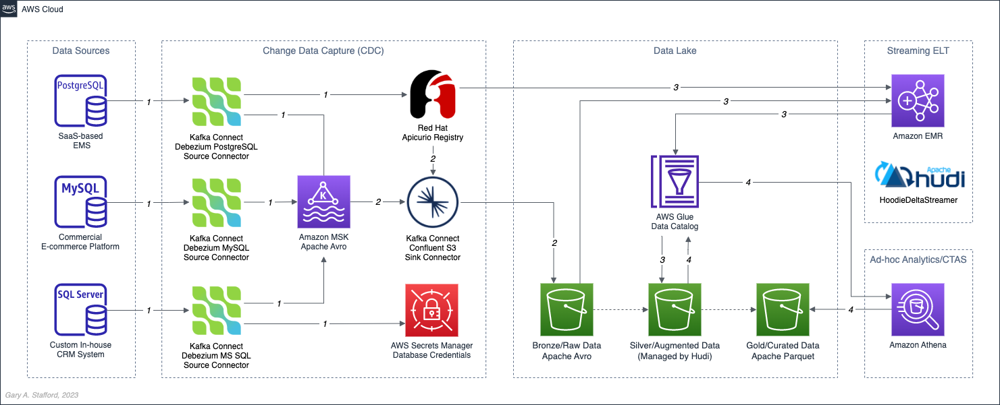

# Building Data Lakes on AWS with Kafka Connect, Debezium, Apicurio Registry, and Apache Hudi

Source code for the blog post, [Building Data Lakes on AWS with Kafka Connect, Debezium, Apicurio Registry, and Apache Hudi]([/](https://garystafford.medium.com/building-data-lakes-on-aws-with-kafka-connect-debezium-apicurio-registry-and-apache-hudi-b4da0268dce)).

## Architecture



## Kafka Connect Commands

```shell
# start kafka connect in background
bin/connect-distributed.sh config/connect-distributed.properties > /dev/null 2>&1 &

# follow log output
tail -f logs/connect.log

# list deployed connectors (does not mean they are working!)
curl -s -X GET http://localhost:8083/connectors | jq

# deploy connectors
curl -d @"config/source_connector_mssql_kafka_avro_tickit.json" \
    -H "Content-Type: application/json" \
    -X POST http://localhost:8083/connectors

curl -d @"config/source_connector_postgres_kafka_avro_tickit.json" \
    -H "Content-Type: application/json" \
    -X POST http://localhost:8083/connectors

curl -d @"config/source_connector_mysql_kafka_avro_tickit.json" \
    -H "Content-Type: application/json" \
    -X POST http://localhost:8083/connectors

curl -d @"config/sink_connector_kafka_s3_avro_tickit.json" \
    -H "Content-Type: application/json" \
    -X POST http://localhost:8083/connectors


# get status of connectors
curl -s -H "Content-Type: application/json" \
    -X GET http://localhost:8083/connectors/source_connector_postgres_kafka_avro_tickit/status | jq

curl -s -H "Content-Type: application/json" \
    -X GET http://localhost:8083/connectors/source_connector_mssql_kafka_avro_tickit/status | jq

curl -s -H "Content-Type: application/json" \
    -X GET http://localhost:8083/connectors/source_connector_mysql_kafka_avro_tickit/status | jq

curl -s -H "Content-Type: application/json" \
    -X GET http://localhost:8083/connectors/sink_connector_kafka_s3_avro_tickit/status | jq


# delete connectors
curl -s -H "Content-Type: application/json" \
    -X DELETE http://localhost:8083/connectors/source_connector_postgres_kafka_avro_tickit | jq

curl -s -H "Content-Type: application/json" \
    -X DELETE http://localhost:8083/connectors/source_connector_mysql_kafka_avro_tickit | jq

curl -s -H "Content-Type: application/json" \
    -X DELETE http://localhost:8083/connectors/source_connector_mssql_kafka_avro_tickit | jq

curl -s -H "Content-Type: application/json" \
    -X DELETE http://localhost:8083/connectors/sink_connector_kafka_s3_avro_tickit | jq
```

## Amazon EMR Commands

```shell
wget https://repo1.maven.org/maven2/org/apache/spark/spark-avro_2.13/3.3.2/spark-avro_2.13-3.3.2.jar
sudo mv spark-avro_2.13-3.3.2.jar /usr/lib/spark/jars/spark-avro.jar

DATA_LAKE_BUCKET="<your_data_lake_s3_bucket>"
TARGET_TABLE="tickit.ecomm.sale"
TARGET_TABLE="tickit.ecomm.listing"
TARGET_TABLE="tickit.ecomm.date"

# merge on read table type
spark-submit \
  --name %{TARGET_TABLE}.mor \
  --jars /usr/lib/spark/jars/spark-avro.jar,/usr/lib/hudi/hudi-utilities-bundle.jar \
  --conf spark.sql.catalogImplementation=hive \
  --conf spark.yarn.submit.waitAppCompletion=false \
  --class org.apache.hudi.utilities.deltastreamer.HoodieDeltaStreamer `ls /usr/lib/hudi/hudi-utilities-bundle.jar` \
  --props file://${PWD}/${TARGET_TABLE}.properties \
  --table-type MERGE_ON_READ \
  --source-ordering-field __source_ts_ms \
  --source-class org.apache.hudi.utilities.sources.AvroDFSSource \
  --schemaprovider-class org.apache.hudi.utilities.schema.SchemaRegistryProvider \
  --target-table ${TARGET_TABLE} \
  --target-base-path s3://${DATA_LAKE_BUCKET}/cdc_hudi_data_lake/silver/${TARGET_TABLE}/ \
  --enable-sync \
  --continuous \
  --op UPSERT \
  > ${TARGET_TABLE}.log 2>&1 &

# copy on write table type
spark-submit \
  --name %{TARGET_TABLE}.cow \
  --jars /usr/lib/spark/jars/spark-avro.jar,/usr/lib/hudi/hudi-utilities-bundle.jar \
  --conf spark.sql.catalogImplementation=hive \
  --conf spark.yarn.submit.waitAppCompletion=false \
  --class org.apache.hudi.utilities.deltastreamer.HoodieDeltaStreamer `ls /usr/lib/hudi/hudi-utilities-bundle.jar` \
  --props file://${PWD}/${TARGET_TABLE}.properties \
  --table-type COPY_ON_WRITE \
  --source-ordering-field __source_ts_ms \
  --source-class org.apache.hudi.utilities.sources.AvroDFSSource \
  --schemaprovider-class org.apache.hudi.utilities.schema.SchemaRegistryProvider \
  --target-table ${TARGET_TABLE} \
  --target-base-path s3://${DATA_LAKE_BUCKET}/cdc_hudi_data_lake/silver/${TARGET_TABLE}/ \
  --enable-sync \
  --continuous \
  --op UPSERT \
  > ${TARGET_TABLE}.log 2>&1 &

# list running yarn applications (deltastreamer spark jobs)
yarn application -list -appTypes SPARK

yarn application -list -appStates RUNNING -appTypes SPARK

# kill continuous deltastreamer spark job
yarn application -kill <job_id_from_above>
```

---

_The contents of this repository represent my viewpoints and not of my past or current employers, including Amazon Web Services (AWS). All third-party libraries, modules, plugins, and SDKs are the property of their respective owners._
